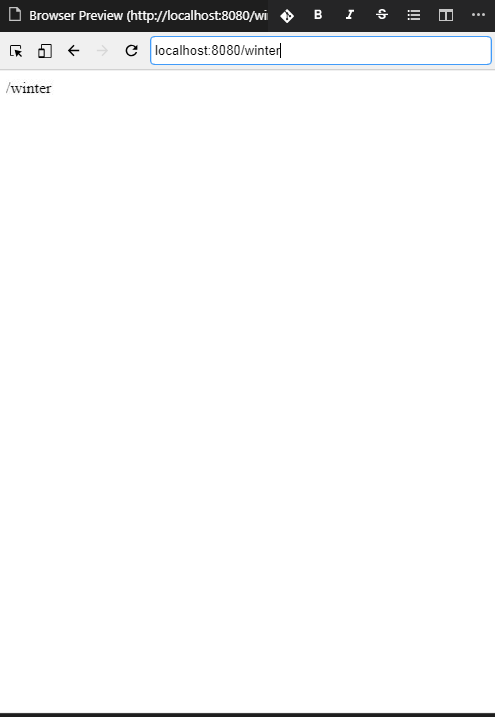

# Node.js HTTP Module

## the built-in HTTP Module

Node.js has a built-in module called HTTP, which allows Node.js to transfer data over the Hyper Text Transfer Protocol(HTTP).

- To include the HTTP module, use the require() method:

```js
var http = require('http');
```

### Node.js as a Web Server

> The HTTP module can create an HTTP server that listens to server ports and gives a response back to the client.
Use the **createServer()** method to create an HTTP server:

```js

var http = require('http');

// create a server object:
http.createServer(function (req, res) {
    res.write('Hello World!'); // write a reponse to the client
    res.end(); // end the response
}).listen(8080); // the server object listens on port 8080@
```

> The funtion passed into the **http.createServer()** method, will be executed when someone tries to access the computer on port 8080.

> Save the file above separately, and run node server in terminal by node "file name"

> Can access the server on browser localhost:8080

## Add an HTTP Header

> If the response from the HTTP server is supposed to be dispayed as HTML , you should include an HTTP header with the correct content type:


```js

var http = require('http');
http.createServer(function (req, res) {
    res.writeHead(200, {'Content-Type': 'text/html'});
    res.write('Hello World!');
    res.end(); 
}).listen(8080);
```

res.writeHead() method is the status code,<br>
200 means : all is OK <br>
Second argument is an object containing the response headers.

## Read the Query String

> http.createServer() **req** argument : represents the *request* from the client.<br>
as an object (http.IncomingMessage object)<br>


This object has a property called "url" which holds the part of the url that comes after the domain name:

```js
var http = require('http');
http.createServer(function (req, res) {
    res.writeHead(200, {'Content-Type': 'text/html'});
    res.write(req.url);
    res.end();
}).listen(8080);
```



> The result of this, the word will be written in the content(body of website) **what you wrote in the url.**


<br>

## Split the Query String

There are built-in modules to easily split the query string into readable parts, such as the URL module.

